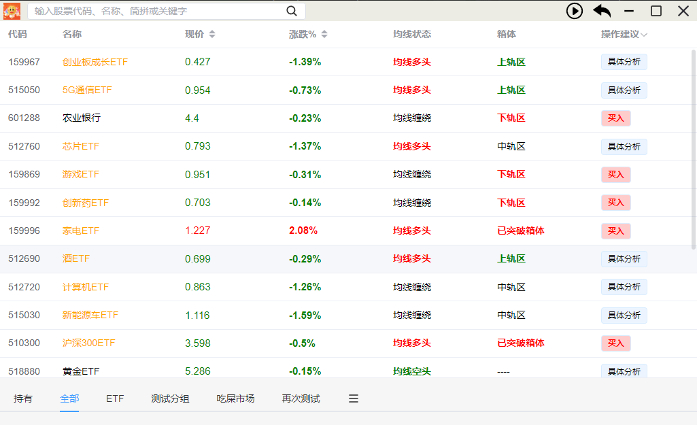
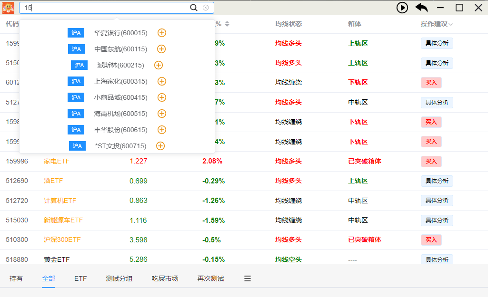
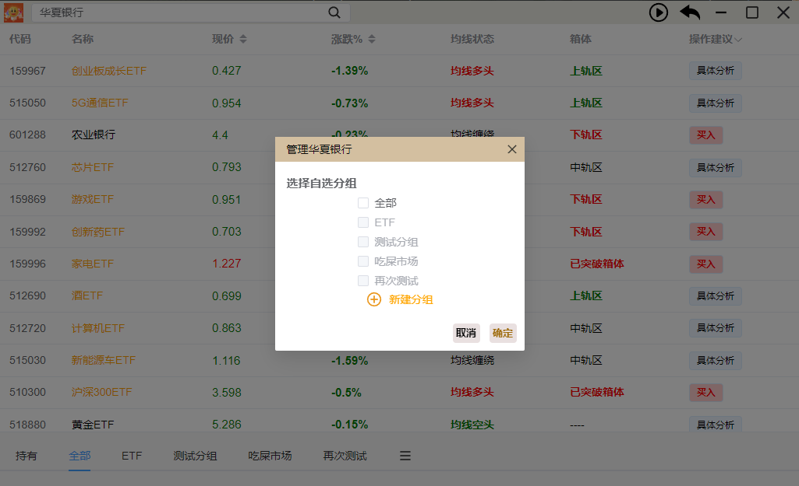
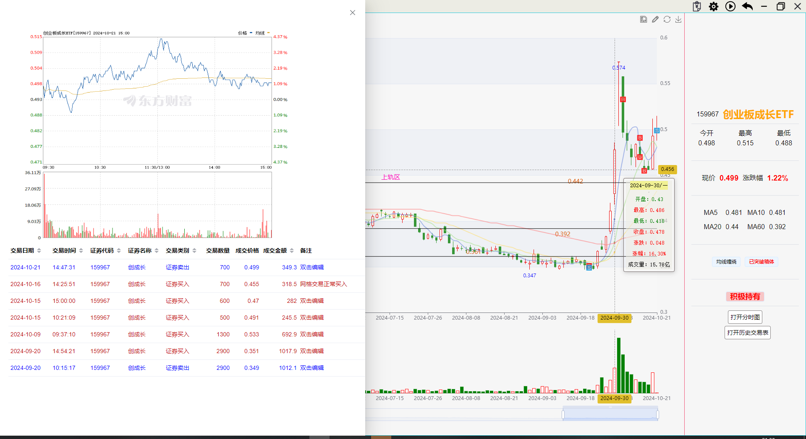

# TradeTip

     
  
  
  
  

[简体中文](README.zh.md)

The specific version update instructions can be viewed at [update record](UpdateRecord.md).

<h3>Introduction</h3>

___

This is a financial assistant client that helps you analyze stocks and funds that interest you. The main indicators are box trend and moving average.

<h3>Features</h3>

___

It has the following features:
- Provide real-time data, historical candlestick data, historical trading volume, box analysis, and moving average analysis.
- Support online search and adding stocks, group management.
- Lightweight, written using Rust. Fast speed.
- Support price lines, straight lines, diagonal lines, etc.
- Support importing historical transaction data, summarizing and analyzing at a glance.
- Multi platform support.

<h3>Development Plan</h3>

---

- [ ] setting window.
- [√] import transaction data and analyze.
- [ ] enable redownload stock candlestick data.

<h3>Application screenshot</h3>

___

